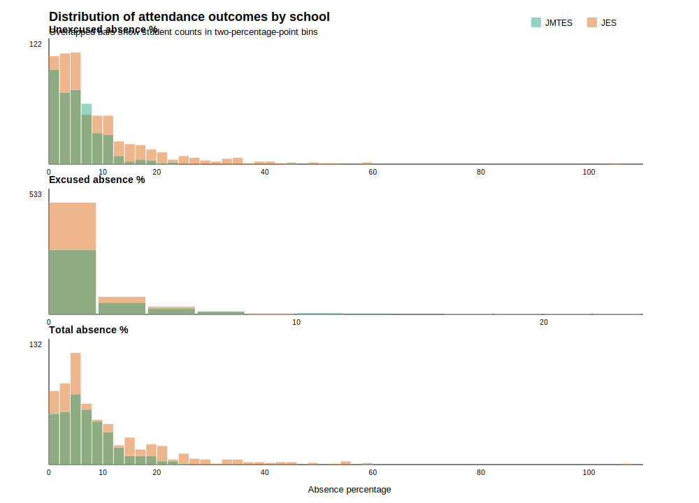

# Descriptive Statistics for Attendance Outcomes

Table 3 Descriptive Statistics for Attendance Outcomes

| Outcome | JMTES mean | JMTES SD | JES mean | JES SD | Difference-in-mean (JMTES - JES) | JMTES median | JES median |
|---|---:|---:|---:|---:|---:|---:|---:|
| Unexcused absence % | 6.070 | (4.711) | 9.009 | (10.074) | -2.939 | 5.294 | 5.882 |
| Excused absence % | 1.739 | (2.496) | 1.287 | (2.180) | 0.452 | 1.176 | 0.588 |
| Total absence % | 7.809 | (5.612) | 10.296 | (10.747) | -2.487 | 7.059 | 6.471 |
| Observations | 417 |  | 676 |  |  | 417 | 676 |

Notes: The table reports unweighted descriptive statistics by school. Attendance outcomes are percentages of enrolled days missed. Absence percentages were calculated using 170 report school days for both JMTES and JES. Standard deviations are reported in parentheses below means. The difference-in-mean column is JMTES minus JES.

Descriptively, JMTES students had a lower mean unexcused absence percentage than JES students. The mean unexcused absence rate was 6.07 percent at JMTES compared with 9.01 percent at JES, a difference of -2.94 percentage points. The median unexcused absence rate was also lower at JMTES, at 5.29 percent compared with 5.88 percent at JES. The large difference between the mean and median for JES suggests that the JES distribution is right-skewed, with a subset of students having very high unexcused absence rates that pull the mean upward.

Excused absences moved in the opposite direction. The mean excused absence percentage was 1.74 percent at JMTES and 1.29 percent at JES, so JMTES was higher by 0.45 percentage points. The median excused absence percentage was also higher at JMTES, at 1.18 percent compared with 0.59 percent at JES. This suggests that JMTES students had somewhat higher documented or approved absences than JES students.

For total absences, the lower unexcused absence rate at JMTES more than offsets the higher excused absence rate in the mean comparison. The mean total absence percentage was 7.81 percent at JMTES compared with 10.30 percent at JES, a difference-in-mean of -2.49 percentage points. However, the median total absence percentage was slightly higher at JMTES, at 7.06 percent compared with 6.47 percent at JES. This pattern suggests that the lower mean total absence rate at JMTES is partly influenced by the JES distribution having more students with very high absence rates, while the middle of the total absence distribution is relatively similar across schools.

These descriptive statistics are unadjusted, meaning that they do not account for differences in student characteristics or other factors that may vary between the two schools. This means that the difference in means may be caused by factors other than GROW. Therefore, the descriptive results should be interpreted as raw comparisons between JMTES and JES, not as direct evidence that GROW caused the observed attendance differences.
