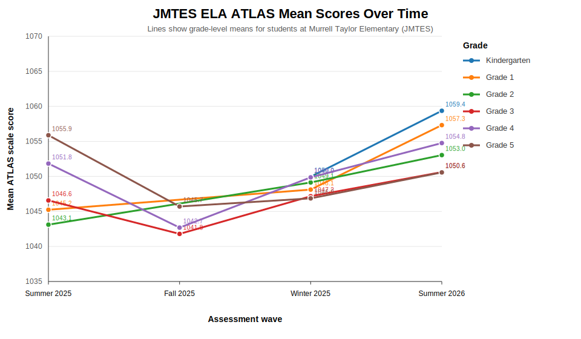
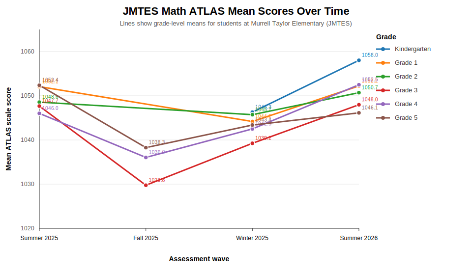
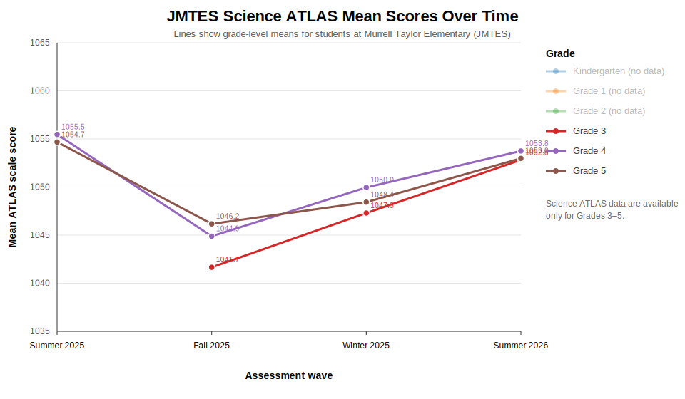

# Impact of GROW on Academic Performance

## Evaluation question

The GROW program may affect academic performance by strengthening students' financial capability, sense of ownership over their future, motivation, school engagement, and aspirations for postsecondary education. The preliminary academic-impact question is therefore whether students at the GROW school, Murrell Taylor Elementary (JMTES), had stronger end-of-year ATLAS outcomes than comparable students at the non-participating comparison school, Jacksonville Elementary (JES).

## Data and measurement

This preliminary analysis uses student-level Arkansas Teaching, Learning & Assessment System (ATLAS) records for Kindergarten through Grade 5. JMTES is the GROW school and JES is the comparison school. The outcome is the Summer 2026 summative ATLAS scale score. English Language Arts (ELA) and Mathematics are analyzed in Kindergarten through Grade 5; Science is analyzed in Grades 3 through 5, where science scores are available. ATLAS scale scores are treated as continuous outcomes, with higher values indicating stronger performance.

Across grades, the analysis uses the strongest common pre-outcome baseline available for the same subject. For Grades 1, 2, 4, and 5, the primary baseline is the Summer 2025 prior-year ATLAS score. For Kindergarten, the primary baseline is Winter 2025 because a common JMTES Summer 2025 baseline is not available. For Grade 3 Science, the primary baseline is Winter 2025 because no common prior-year Science baseline is available. Students were included in a subject-level model when they had both the required baseline score and the Summer 2026 outcome score in that subject. In Kindergarten, values below 900 were excluded from the scale-score analysis because the JES Summer 2025 file includes values of 4 and 5 that appear to be screening/performance codes rather than comparable ATLAS scale scores.

## Primary analysis methodology

The primary analysis is a baseline-adjusted regression, also known as ANCOVA. For each grade and subject, Summer 2026 ATLAS score is regressed on an indicator for attending JMTES and the student's own baseline ATLAS score in the same subject:

`Summer 2026 score = intercept + beta_1(JMTES) + beta_2(baseline score) + error`

The coefficient on the JMTES indicator is the preliminary treatment-effect estimate. It represents the adjusted difference in Summer 2026 scores between JMTES and JES students who started at the same baseline achievement level.

ANCOVA was selected as the primary analysis for three reasons. First, GROW was not randomly assigned, and JMTES and JES often differed at baseline. Adjusting for each student's own pre-outcome score is therefore essential for a fair comparison. Second, the available data generally include only one common pre-treatment baseline suitable for each subject, so the parallel-trends assumption required for a stronger difference-in-differences design cannot be evaluated. Third, ANCOVA is usually more statistically efficient than a simple gain-score comparison when baseline and outcome scores are correlated, because it adjusts for baseline achievement without forcing the outcome to be expressed only as raw change.

The analysis remains preliminary. It compares one treatment school with one comparison school, so school-level factors cannot be separated from the GROW program as cleanly as they could be in a randomized or multi-school quasi-experimental design. Results should be interpreted as evidence about whether the data are consistent with an academic benefit, not as definitive causal proof.

## Robustness and sensitivity methodology

Several robustness checks were reviewed to assess whether the same pattern appears under alternative reasonable assumptions:

- DiD-style pre/post comparisons compare the change in JMTES scores with the change in JES scores. These are useful descriptive checks, but they are not the preferred primary analysis because the data do not allow the parallel-trends assumption to be tested.
- HC3 robust standard errors were applied to DiD-style models to test whether inference changes when standard errors are less sensitive to heteroskedasticity.
- Gain-score models compare baseline-to-outcome changes between schools. These are intuitive, but they can be noisier than ANCOVA and can be sensitive to regression-to-the-mean when schools differ at baseline.
- Wilcoxon rank-sum tests compare the distribution of gains without assuming normally distributed changes. These tests are useful nonparametric checks but do not adjust as flexibly for baseline achievement.
- Winsorized gain-score models reduce the influence of extreme gain values.
- Calipered nearest-neighbor matching pairs JMTES students with JES students who had similar baseline scores, using exact matching by subject and a 0.20 pooled-standard-deviation caliper. Matching is useful because it checks whether results persist among students with very similar observed baseline achievement, but it cannot address unobserved school, classroom, or family differences.
- Inverse probability weighting (IPW) reweights students by the estimated probability of being in the treatment group based on baseline scores. Like matching, IPW adjusts only for observed baseline differences.
- Permutation tests and bootstrap confidence intervals assess how sensitive the ANCOVA conclusions are to distributional assumptions and sampling variability.

Because the robustness analyses answer slightly different questions, they were not used to replace the primary analysis. Instead, they were used to assess credibility. The strongest evidence occurs when the primary ANCOVA estimate is statistically significant and most robustness checks are positive and directionally consistent. The weakest evidence occurs when ANCOVA is not statistically significant and robustness checks are mixed or negative.

## Descriptive patterns by grade

The descriptive mean scores show that JMTES often had higher raw Summer 2026 means than JES, especially in Grades 3 and 4. However, raw means alone are not sufficient because baseline differences vary by grade and subject. For example, JMTES entered Grade 5 with substantially higher Summer 2025 means than JES, which makes unadjusted Summer 2026 comparisons potentially misleading. The primary interpretation therefore relies on baseline-adjusted results rather than raw end-of-year differences.

The following plots show changes in average ATLAS scores over time for JMTES students. Separate plots are shown for ELA, Math, and Science, with one line per available grade. ELA and Math include Kindergarten through Grade 5. Science ATLAS scores are available only for Grades 3 through 5 in the current files, so the Science plot marks Kindergarten through Grade 2 as unavailable rather than imputing nonexistent scores.

## Primary ANCOVA findings

| Grade | Subject | Adjusted JMTES effect | p-value | 95% CI | Preliminary interpretation |
|---|---|---:|---:|---|---|
| Kindergarten | ELA | -1.59 | 0.432 | [-5.57, 2.38] | Not statistically significant |
| Kindergarten | Math | 2.51 | 0.160 | [-0.99, 6.02] | Positive but not statistically significant |
| Grade 1 | ELA | 2.81 | 0.318 | [-2.70, 8.31] | Positive but not statistically significant |
| Grade 1 | Math | -0.65 | 0.746 | [-4.56, 3.27] | Not statistically significant |
| Grade 2 | ELA | 4.51 | 0.133 | [-1.37, 10.38] | Positive but not statistically significant |
| Grade 2 | Math | 1.26 | 0.451 | [-2.02, 4.54] | Not statistically significant |
| Grade 3 | ELA | 6.85 | <0.001 | [3.57, 10.13] | Statistically significant positive effect |
| Grade 3 | Math | 6.42 | <0.001 | [3.07, 9.76] | Statistically significant positive effect |
| Grade 3 | Science | 2.20 | 0.117 | [-0.55, 4.95] | Positive but not statistically significant |
| Grade 4 | ELA | 6.14 | <0.001 | [2.97, 9.32] | Statistically significant positive effect |
| Grade 4 | Math | 8.20 | <0.001 | [5.06, 11.35] | Statistically significant positive effect |
| Grade 4 | Science | 3.62 | 0.030 | [0.36, 6.89] | Statistically significant positive effect |
| Grade 5 | ELA | -1.56 | 0.391 | [-5.13, 2.01] | Not statistically significant |
| Grade 5 | Math | -1.05 | 0.572 | [-4.68, 2.58] | Not statistically significant |
| Grade 5 | Science | 4.23 | 0.030 | [0.40, 8.06] | Statistically significant positive effect, but less robust |

The clearest positive academic evidence appears in Grades 3 and 4. Grade 3 shows statistically significant adjusted positive effects in ELA and Math, while Grade 4 shows statistically significant adjusted positive effects in ELA, Math, and Science. The lower grades are generally directionally positive in several subjects but not statistically significant in the primary analysis. Grade 5 ELA and Math do not show evidence of a positive adjusted impact; Grade 5 Science is positive in ANCOVA but should be interpreted cautiously because several robustness checks are weaker.

## Robustness findings by grade

### Kindergarten

Kindergarten results are exploratory because Winter 2025 is the only common baseline for JMTES and JES. The primary ANCOVA estimates are not statistically significant for ELA or Math. Robustness checks are mixed: ELA is generally negative or null, while Math is more favorable in rank-based and winsorized gain checks. Matching estimates are positive for both subjects but not conventionally significant. Overall, Kindergarten provides no clear evidence of an academic impact, although Math shows a modest positive signal in some sensitivity checks.

### Grade 1

Grade 1 uses Summer 2025 as the preferred pre-GROW baseline. The primary ANCOVA estimates are not statistically significant: ELA is positive and Math is slightly negative. Robustness checks are mixed for ELA, with matching positive and statistically significant but gain-style checks negative; Math checks are mostly null or negative. Overall, Grade 1 does not provide clear evidence of a GROW effect on ATLAS scores.

### Grade 2

Grade 2 is directionally positive in ELA and weaker in Math. The primary ELA ANCOVA estimate is positive but not statistically significant, and ELA gain, winsorized gain, matching, IPW, permutation, and bootstrap checks are generally positive but mostly not significant. Math results are small and inconsistent, including a negative matching estimate. Overall, Grade 2 provides suggestive but inconclusive evidence for ELA and little evidence for Math.

### Grade 3

Grade 3 provides strong evidence for ELA and Math. The primary ANCOVA estimates are positive and statistically significant in both subjects. Most robustness checks are also positive, including gain-score models, Wilcoxon tests, winsorized gains, matching, IPW, permutation tests, and bootstrap confidence intervals. Grade 3 Science is less conclusive: the primary estimate is positive but not statistically significant, matching is strongly positive, but gain-style checks are negative. Overall, Grade 3 supports a preliminary conclusion of improved ELA and Math performance at JMTES.

### Grade 4

Grade 4 provides the most consistently positive evidence. The primary ANCOVA estimates are positive and statistically significant in ELA, Math, and Science. Math is especially robust: gain, winsorized gain, matching, IPW, permutation, and bootstrap checks all support a positive effect. ELA is also favorable, although DiD-style and gain models are positive but not always statistically significant. Science is positive in ANCOVA, matching, permutation, and bootstrap checks, but gain-style checks are near zero, so the Science finding is positive but somewhat less robust than Math. Overall, Grade 4 provides the strongest grade-level evidence of a GROW-associated academic benefit.

### Grade 5

Grade 5 results are mixed and mostly not supportive for ELA or Math. The primary ANCOVA estimates for ELA and Math are negative and not statistically significant after accounting for JMTES's higher Summer 2025 baseline. Several ELA and Math gain-style checks are negative, indicating that raw growth from the higher baseline was weaker at JMTES than at JES. Science is positive and statistically significant in ANCOVA, but DiD-style, gain, matching, and IPW checks are not statistically significant. Overall, Grade 5 Science is promising but not robust enough to treat as definitive, while Grade 5 ELA and Math do not show a positive GROW impact.

## Overall preliminary interpretation

The preliminary academic-impact evidence is strongest in Grades 3 and 4, especially for ELA and Math. These grades show positive, statistically significant baseline-adjusted effects, and the results are generally supported by robustness checks. Grade 4 Science and Grade 5 Science also show positive primary ANCOVA effects, but the Science evidence is less consistent across robustness checks, particularly because some gain-style comparisons are near zero or negative.

The evidence is weaker in Kindergarten through Grade 2. This pattern does not necessarily mean the program had no effect in the early grades; younger students may need more time for program-related motivation or engagement to translate into measurable summative test differences, and smaller sample sizes reduce statistical power. However, based on the current ATLAS data, early-grade findings should be described as null or suggestive rather than conclusive.

The preferred preliminary conclusion is that the current data are consistent with a positive GROW-associated academic effect in upper elementary grades, most clearly in Grade 3 ELA/Math and Grade 4 ELA/Math/Science. The evidence does not support a broad claim of positive effects across every grade and subject. Future analyses should add more years of data, additional comparison schools if available, and student-level covariates such as prior achievement history, attendance, demographic characteristics, and mobility to strengthen causal inference.
