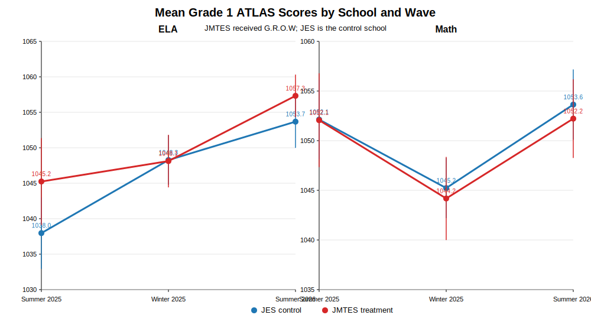

# Grade 1 ATLAS G.R.O.W Analysis Results

## Mean ATLAS scale scores by subject, school, and wave

| Subject | Wave | School | N | Mean | SD | SE |
|---|---|---:|---:|---:|---:|---:|
| ELA | Summer 2025 | JES | 102 | 1037.97 | 25.96 | 2.57 |
| ELA | Summer 2025 | JMTES | 49 | 1045.24 | 21.85 | 3.12 |
| ELA | Winter 2025 | JES | 110 | 1048.26 | 18.68 | 1.78 |
| ELA | Winter 2025 | JMTES | 57 | 1048.12 | 14.28 | 1.89 |
| ELA | Summer 2026 | JES | 113 | 1053.68 | 20.06 | 1.89 |
| ELA | Summer 2026 | JMTES | 59 | 1057.32 | 11.72 | 1.53 |
| Math | Summer 2025 | JES | 102 | 1052.13 | 20.53 | 2.03 |
| Math | Summer 2025 | JMTES | 49 | 1052.06 | 16.88 | 2.41 |
| Math | Winter 2025 | JES | 110 | 1045.23 | 16.20 | 1.55 |
| Math | Winter 2025 | JMTES | 56 | 1044.18 | 15.98 | 2.14 |
| Math | Summer 2026 | JES | 112 | 1053.63 | 19.11 | 1.81 |
| Math | Summer 2026 | JMTES | 59 | 1052.22 | 15.53 | 2.02 |

## Line plot

## Primary analysis: ANCOVA using Summer 2025 baseline

For Grade 1, Summer 2025 is available for both JMTES and JES and is the prior-year summative assessment before the 2025-26 Grade 1 outcome. Therefore, the most appropriate primary model is ANCOVA predicting Summer 2026 from treatment status while adjusting for Summer 2025 baseline score. Winter 2025 is retained as an intermediate/descriptive wave and for sensitivity checks rather than used as the primary baseline covariate.

| Subject | ANCOVA Estimate | SE | Approx. p-value | 95% CI | Interpretation |
|---|---:|---:|---:|---:|---|
| ELA | 2.81 | 2.81 | 0.318 | [-2.70, 8.31] | Positive but not statistically significant |
| Math | -0.65 | 2.00 | 0.746 | [-4.56, 3.27] | Negative and not statistically significant |

## Sensitivity and robustness checks

| Subject | Method | Estimate | Approx. p-value / interval | Interpretation |
|---|---|---:|---:|---|
| ELA | DiD-style baseline-to-post | -2.51 | p = 0.633 | Negative; sensitivity only |
| Math | DiD-style baseline-to-post | -0.52 | p = 0.910 | Negative; sensitivity only |
| ELA | Gain-score model | -2.51 | p = 0.556 | Negative; sensitivity only |
| Math | Gain-score model | -0.52 | p = 0.807 | Negative; sensitivity only |
| ELA | Calipered Summer 2025 baseline matching | 5.54 | p = 0.033 | Matched 48/48; sensitivity only |
| Math | Calipered Summer 2025 baseline matching | -1.83 | p = 0.355 | Matched 48/48; sensitivity only |
| ELA | IPW | 3.68 | p = 0.143 | Propensity-score-based weighting; exploratory |
| Math | IPW | -0.69 | p = 0.816 | Propensity-score-based weighting; exploratory |
| ELA | ANCOVA permutation test | 2.81 | p = 0.322 | Exploratory student-label permutation |
| Math | ANCOVA permutation test | -0.65 | p = 0.752 | Exploratory student-label permutation |
| ELA | ANCOVA bootstrap CI | 2.81 | [-1.48, 7.36] | Bootstrap CI |
| Math | ANCOVA bootstrap CI | -0.65 | [-4.17, 2.97] | Bootstrap CI |

The matching method mirrors the Kindergarten matching strategy: exact-by-subject, nearest-neighbor matching on the strongest available baseline score, with replacement and a 0.20 pooled-SD caliper. For Grade 1, the baseline score is Summer 2025 because that is the clean prior-year pre-G.R.O.W assessment available for both schools.

## Interpretation

For Grade 1, ANCOVA using the Summer 2025 prior-year summative score is the preferred primary analysis because it adjusts for pre-G.R.O.W achievement without conditioning on the Winter 2025 mid-year score, which may already reflect some program exposure. Results should still be interpreted cautiously because there is one treatment school and one control school.

The primary ANCOVA estimate is positive for ELA and negative for Math, and neither estimate is statistically significant. ELA sensitivity checks are mixed: matching and IPW are positive, while DiD-style and gain-score checks are negative. Math sensitivity checks are mostly negative or null. Overall, the Grade 1 evidence does not provide clear evidence of a G.R.O.W impact on ATLAS scores. More years, more comparison schools, and richer covariates would strengthen causal inference.
