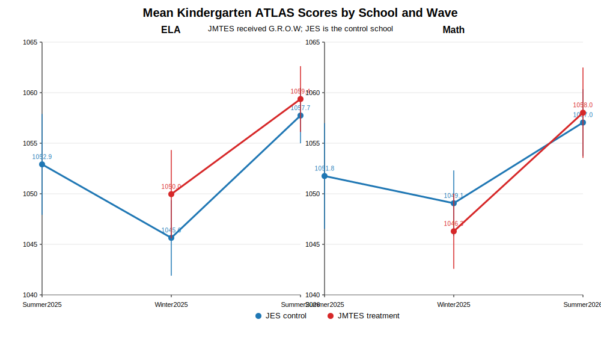

# Kindergarten ATLAS G.R.O.W Analysis Results

## Mean ATLAS scale scores by subject, school, and wave

Values below 900 were excluded from the scale-score analysis because the JES Summer 2025 file includes `4`/`5` values that appear to be screening/performance codes rather than comparable ATLAS scale scores.

| Subject | Wave | School | N | Mean | SD | SE |
|---|---|---:|---:|---:|---:|---:|
| ELA | Summer 2025 | JES | 55 | 1052.91 | 18.87 | 2.54 |
| ELA | Winter 2025 | JES | 114 | 1045.64 | 20.39 | 1.91 |
| ELA | Winter 2025 | JMTES | 52 | 1049.96 | 16.07 | 2.23 |
| ELA | Summer 2026 | JES | 126 | 1057.74 | 15.71 | 1.40 |
| ELA | Summer 2026 | JMTES | 54 | 1059.37 | 12.20 | 1.66 |
| Math | Summer 2025 | JES | 53 | 1051.75 | 19.42 | 2.67 |
| Math | Winter 2025 | JES | 111 | 1049.06 | 17.47 | 1.66 |
| Math | Winter 2025 | JMTES | 52 | 1046.29 | 13.66 | 1.89 |
| Math | Summer 2026 | JES | 126 | 1057.05 | 18.93 | 1.69 |
| Math | Summer 2026 | JMTES | 54 | 1058.02 | 16.76 | 2.28 |

## Line plot

## Primary analysis: ANCOVA

ANCOVA is the preferred primary analysis for the current Kindergarten ATLAS data because it compares Summer 2026 outcomes between JMTES and JES while adjusting for Winter 2025 baseline scores. This is preferable to using DiD as the primary model because there is only one common pre-period, so the DiD parallel trends assumption cannot be evaluated.

| Subject | ANCOVA Estimate | SE | Approx. p-value | 95% CI | Interpretation |
|---|---:|---:|---:|---:|---|
| ELA | -1.59 | 2.03 | 0.432 | [-5.57, 2.38] | Adjusted JMTES score is lower than JES, but not statistically significant |
| Math | 2.51 | 1.79 | 0.160 | [-0.99, 6.02] | Adjusted JMTES score is higher than JES, but not statistically significant |

## Sensitivity check: DiD-style pre/post comparison

The DiD-style model uses Winter 2025 as the pre-period and Summer 2026 as the post-period. The reported estimate is the treatment-by-post interaction, equivalent to `(JMTES post - JMTES pre) - (JES post - JES pre)`. This is a useful descriptive comparison of whether JMTES improved more than JES, but it should not be treated as definitive causal evidence because the parallel trends assumption cannot be tested with only one common pre-period.

| Subject | JMTES Change | JES Change | DiD Estimate | SE | Approx. p-value | 95% CI |
|---|---:|---:|---:|---:|---:|---:|
| ELA | 9.41 | 12.10 | -2.69 | 3.97 | 0.498 | [-10.47, 5.09] |
| Math | 11.73 | 7.98 | 3.75 | 4.07 | 0.358 | [-4.23, 11.73] |

## Additional robustness checks

| Subject | Analysis | Estimate | SE | Approx. p-value | 95% CI | Interpretation |
|---|---|---:|---:|---:|---:|---|
| ELA | DiD with HC3 robust SE | -2.69 | 3.68 | 0.465 | [-9.90, 4.52] | Not statistically significant |
| ELA | Student gain-score model | -4.22 | 2.80 | 0.132 | [-9.70, 1.26] | Not statistically significant |
| ELA | Wilcoxon rank-sum test on gains | — | — | 0.450 | — | Not statistically significant |
| ELA | Winsorized gain-score model | -4.72 | 2.42 | 0.051 | [-9.45, 0.02] | Borderline negative, not conventionally significant |
| Math | DiD with HC3 robust SE | 3.75 | 3.82 | 0.327 | [-3.74, 11.23] | Not statistically significant |
| Math | Student gain-score model | 2.73 | 1.79 | 0.127 | [-0.78, 6.24] | Not statistically significant |
| Math | Wilcoxon rank-sum test on gains | — | — | 0.020 | — | JMTES gains are significantly higher by rank test |
| Math | Winsorized gain-score model | 3.06 | 1.52 | 0.044 | [0.08, 6.05] | Positive and statistically significant |

## Additional impact-analysis methods added to the R Markdown

Matching can be used here as a sensitivity analysis because both schools have student-level Winter 2025 baseline scores. The R Markdown now uses the preferred matching method for the current files: exact-by-subject, calipered nearest-neighbor matching on Winter 2025 baseline score with replacement. The 0.20 pooled-SD caliper prevents poor baseline-score matches, while replacement improves match quality when the control pool is limited. Matching is not the primary analysis because it can only adjust for observed baseline-score differences and cannot address unobserved student, classroom, or school differences.

| Subject | Matched / treated | Caliper | Mean baseline distance | Matching estimate | SE | Approx. p-value | 95% CI | Interpretation |
|---|---:|---:|---:|---:|---:|---:|---:|---|
| ELA | 52 / 52 | 3.83 | 0.25 | 2.37 | 1.55 | 0.126 | [-0.67, 5.40] | Positive but not statistically significant |
| Math | 52 / 52 | 3.27 | 0.19 | 3.50 | 1.91 | 0.066 | [-0.24, 7.24] | Positive and marginal, but not conventionally significant |

The R Markdown also now includes inverse probability weighting (IPW), permutation tests for the ANCOVA coefficient, and bootstrap confidence intervals for the ANCOVA coefficient. These are useful sensitivity checks, but they remain exploratory because the study has only one treatment school and one control school.

| Subject | Method | Estimate | Approx. p-value / interval | Interpretation |
|---|---|---:|---:|---|
| ELA | IPW treatment effect | -1.72 | p = 0.425 | Not statistically significant |
| Math | IPW treatment effect | 2.22 | p = 0.431 | Not statistically significant |
| ELA | ANCOVA permutation test | -1.59 | p = 0.451 | Not statistically significant |
| Math | ANCOVA permutation test | 2.51 | p = 0.165 | Not statistically significant |
| ELA | ANCOVA bootstrap CI | -1.59 | [-4.97, 1.78] | Not statistically significant |
| Math | ANCOVA bootstrap CI | 2.51 | [-0.68, 5.74] | Not statistically significant |

The R Markdown also lists methods that are not recommended as primary analyses with the current files: full causal DiD/event study, student fixed effects, school fixed effects with clustered standard errors, regression discontinuity, instrumental variables, and synthetic control. Those approaches would require additional pre-treatment waves, more schools, a valid cutoff, a valid instrument, or a larger control pool.

## Interpretation

The Kindergarten results are mixed by subject. For ELA, the primary ANCOVA estimate is negative and not statistically significant. This means that, after controlling for Winter 2025 baseline ELA scores, JMTES did not have higher Summer 2026 ELA scores than JES. The DiD-style and gain-score checks also do not provide positive evidence for ELA.

For Math, the primary ANCOVA estimate is positive, suggesting JMTES scored about 2.51 points higher than JES in Summer 2026 after adjusting for Winter 2025 Math scores, but this estimate is not statistically significant. Some gain-based robustness checks are positive and statistically significant, so the Math results are directionally promising but should be interpreted as suggestive rather than conclusive.

Overall, ANCOVA is the better primary analysis for this two-wave Kindergarten dataset. Matching, IPW, permutation tests, bootstrap intervals, DiD-style comparisons, and gain-score models are useful sensitivity checks. The evidence does not show a clear G.R.O.W impact in ELA. Math findings are more encouraging across several sensitivity checks, but the primary adjusted estimate is not statistically significant, so additional years, additional comparison schools, richer student-level covariates, and evidence supporting pre-program comparability would be needed for stronger causal claims.
