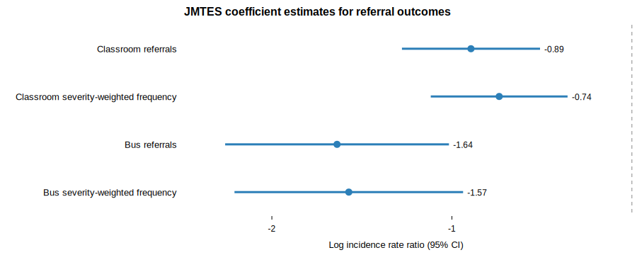

# Results

Table 1 Impact of GROW on Behavioral Referral Outcomes

|  | Classroom referrals | Classroom severity-weighted frequency | Bus referrals | Bus severity-weighted frequency |
|---|---:|---:|---:|---:|
|  | (1) | (2) | (3) | (4) |
| Model | OW Poisson + covariates | OW Poisson + covariates | OW Poisson + covariates | OW Poisson + covariates |
| JMTES (GROW school) | -0.894*** | -0.737*** | -1.638*** | -1.573*** |
|  | (0.196) | (0.194) | (0.317) | (0.324) |
| Incidence rate ratio | 0.409 | 0.478 | 0.194 | 0.207 |
| Percent difference | -59.1% | -52.2% | -80.6% | -79.3% |
| JES weighted rate per 170 days | 0.669 | 1.558 | 0.163 | 0.331 |
| JMTES weighted rate per 170 days | 0.274 | 0.750 | 0.032 | 0.071 |
| Student covariates | Yes | Yes | Yes | Yes |
| Overlap weights | Yes | Yes | Yes | Yes |
| Enrollment-days offset | Yes | Yes | Yes | Yes |
| Observations | 1,095 | 1,095 | 1,095 | 1,095 |
| Referral events | 574 | 1,385 | 122 | 249 |

Notes: The table reports overlap-weighted Poisson regression estimates. The JMTES coefficient is the log incidence-rate difference between students at the GROW school and comparable students at the comparison school. Robust standard errors are in parentheses. Incidence rate ratios are shown for interpretation; values below 1 indicate lower referral rates at JMTES. Student covariates include grade, gender, race/ethnicity, age, meal-status disadvantage, and entry-code controls. Each model includes an exposure offset for enrollment days. *** p<0.01, ** p<0.05, * p<0.10.

The overlap-weighted Poisson results suggest that GROW is associated with lower rates of behavioral referrals, especially for overall classroom and bus referral frequency. For classroom referrals, students at JMTES had an estimated log incidence-rate difference of -0.89, corresponding to an incidence rate ratio of 0.409. This implies that comparable JMTES students had a referral rate that was approximately 59.1 percent lower than comparable JES students. The weighted classroom referral rate was 0.27 referrals per 170 enrolled days at JMTES compared with 0.67 at JES.

The classroom severity-weighted frequency results point in the same direction. The estimated incidence rate ratio was 0.478, implying a 52.2 percent lower severity-weighted classroom referral rate at JMTES than at JES. This suggests that the reduction in classroom behavioral referrals was not limited to the overall count of incidents but also appears in the frequency of severity-weighted incidents.

For bus-related referrals, the estimated JMTES coefficient was -1.64, corresponding to an incidence rate ratio of 0.194. This implies that comparable JMTES students had an overall bus referral rate approximately 80.6 percent lower than comparable JES students. The weighted bus referral rate was 0.03 referrals per 170 enrolled days at JMTES compared with 0.16 at JES.

The bus severity-weighted outcome also suggests lower referral frequency at JMTES. The estimated incidence rate ratio was 0.207, implying a 79.3 percent lower severity-weighted bus referral rate. Taken together, the bus results suggest that GROW is associated with reductions in both the overall frequency of bus referrals and the frequency of more severe bus-related incidents.

These estimates should be interpreted as quasi-experimental rather than definitive causal effects. The overlap-weighted design improves comparability by emphasizing students with similar observed characteristics across JMTES and JES, and the Poisson models further adjust for student covariates and enrollment exposure. However, students were not randomly assigned to schools, and unmeasured school-level or family-level differences may still contribute to the observed behavioral differences.
